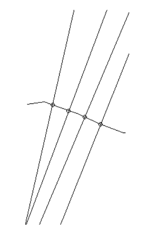
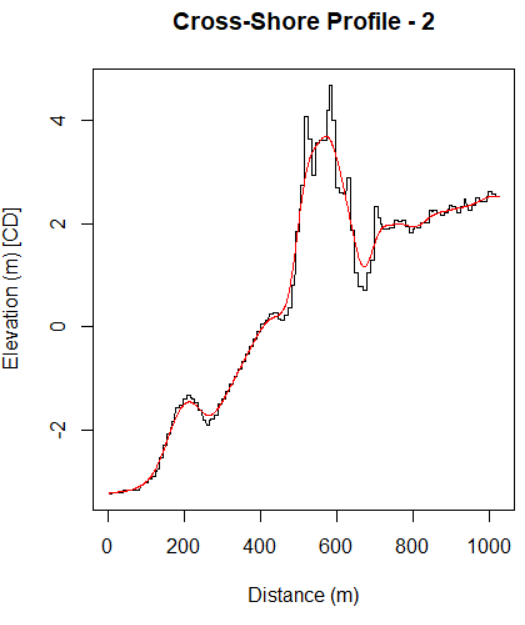
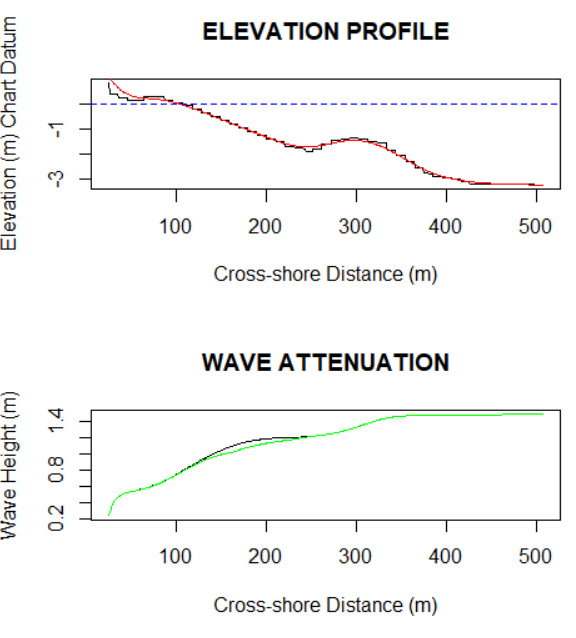
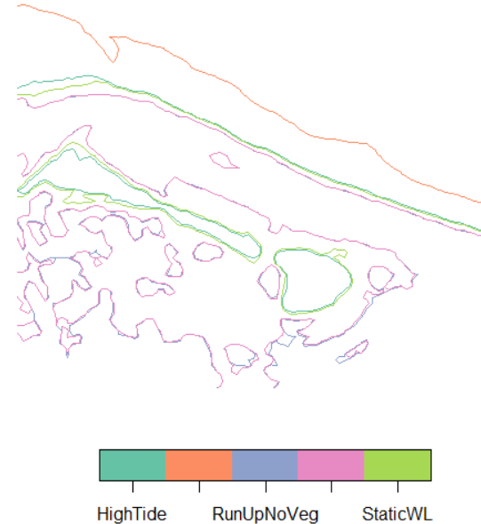
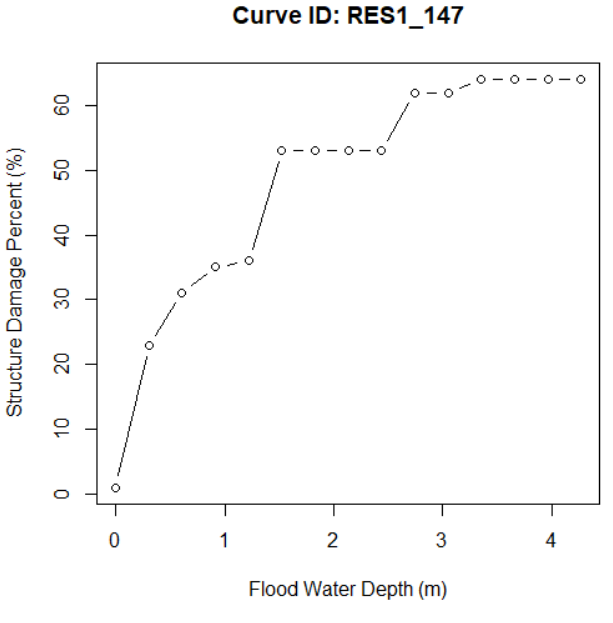

# MNAI.CPBT
## *The Municipal Natural Asset Initiative Coastal Protection and Benefit Tool*


<!-- badges: start -->
[](https://www.tidyverse.org/lifecycle/#stable)
[](https://cran.r-project.org/package=MNAI.CPBT)
<!-- badges: end -->


  The **MNAI.CPBT** package contains functions to model coastal wave attenuation, shoreline erosion and flooding. This package is an adaptation of the Natural Capital [InVEST](https://naturalcapitalproject.stanford.edu/software/invest) Wave Attenuation and Erosion Reduction ArcGIS Toolbox originally developed by Greg Guannel. Functions and workflows have been modified for evaluating municipal natural assets. This tool is a software product of the [Municipal Natural Asset Initiative MNAI](https://mnai.ca/).


## Guidance Document

We recommend that all interested users consult the MNAI - CPBT: Guidance Document to understand the use cases, strengths, and limitations of this toolbox.
[TODO: ADD LINK TO GUIDANCE DOCUMENT - IN PREP](https://mnai.ca/key-documents/).

## Installation

The easiest way to install the **MNAI.CPBT** is through the remotes::install_github() function within RStudio. Dependencies include the sp, sf and raster packages.

Use the following commands to install the package. Note that you may need to install remotes. We recommend installing all dependencies too.

```r
  # Install remotes if you do not already have it
  # install.packages("remotes")
  library(remotes)
  
  # Install the CPBT
  remotes::install_github("mattjbayly/MNAI.CPBT")
  library(MNAI.CPBT)

```


## Usage

The general workflow includes generating cross-shore profiles along a coastline section, running the wave attenuation model and then estimating beach erosion and structural damages from flood waters.  This repository is referenced by an [ArcGIS toolbox for non-programmers](https://github.com/mattjbayly/CPBT.ArcGIS.Tbx).

### Cross-shore profiles

Generate cross-shore profiles along a coastline.

```r

library(MNAI.CPBT)
data(Coastline)

# Generate cross-shore profile lines along the coastline.
ShorelinePointDist = 150

?samplePoints

crossshore_profiles <- samplePoints(
  Coastline = Coastline,
  ShorelinePointDist = ShorelinePointDist,
  BufferDist = 50, RadLineDist = 1.5)
crossshore_lines <- crossshore_profiles[[2]]

# Plot result
plot(sf::st_geometry(Coastline))
# Shoreline points
plot(sf::st_geometry(crossshore_profiles[[1]]), add=TRUE)
# Cross-shore profiles
plot(sf::st_geometry(crossshore_profiles[[2]]), add=TRUE)

```




### Extract Elevation

Extract elevation values along the profile.

```r
# Extract elevation values along each profile
rpath <-  system.file("extdata", "TopoBathy.tif", package = "MNAI.CPBT")
TopoBathy <- raster::raster(rpath)
pt_elevs <- ExtractElev(crossshore_lines, TopoBathy)

```

### Smooth Profile

Smooth the elevation profile for wave modelling: A smoothed cross-shore profile is necessary for convergence of the wave model. If the bottom surface topography extracted from the TopoBathy DEM is overly rugged, the wave evolution model may produce unexpected results as users may notice wave height increasing and decreasing along the length of the profile. If this is observed try increasing the smoothing parameter or omit that section of coastline from your analysis.

```r

# Run SignalSmooth function to smooth elevation profiles for
# wave model convergence
pt_elevs <- SignalSmooth(point_elev = pt_elevs, SmoothParameter = 10)

# Filter to just the first cross-shore profile
cs1 <- pt_elevs[pt_elevs$line_id == 2, ]
# Filter out any NA values beyond extent of TopoBathy DEM
cs1 <- cs1[!(is.na(cs1$elev)), ]

# Plot original and smoothed values
plot(1:nrow(cs1), cs1$elev, type = 'l', xlab = 'Distance (m)',
ylab = 'Elevation (m) [CD]', main = 'Cross-Shore Profile - 2')

# Compare original elevations to smoothed values
points(1:nrow(cs1), cs1$elev_smooth, type = 'l', col='red')

```



### Clean Transect & Merge Vegetation

Utility function to clean transects and remove anomalies that may break the wave evolution model. This function also ensures that transects are pointing in the correction direction and fixes them if they are not.

ExtractVeg - Merges the cleaned cross-shore profile dataset with vegetation data. Note that this function must be run before the wave evolution and erosion models can be run. Even if your project has no vegetation, running this function is still necessary to format the data frame with appropriate columns.

```r

# Clean the cross-shore profiles with CleanTransect
cleantransect <- CleanTransect(
  point_elev = pt_elevs,
  RadLineDist = 1.5, MaxOnshoreDist = 0.01, trimline = NA
)

# Merge vegetation onto lines
data(Vegetation)
dat_veg <- ExtractVeg(pt_exp = cleantransect, Vegetation = Vegetation)

```

### Wave Model

Wave attenuation model originally developed by Dr. Greg Guannel for the Coastal Natural Capital InVEST project. This function models wave attenuation along a cross-shore elevation profile. Input parameters include a pre-processed cross shore profile dataset (dat) developed through the sequence of functions show in the example, the total water surface level of still water (total_wsl_adj) above the chart datum, the wave height (Ho) and wave period (To). After running the function populates the original input dataset (dat) with the follow data attributes: wave setup with vegetation (Eta), wave setup without vegetation (Etas), bottom orbital velocity (Ubot), wave height with vegetation (H_veg), wave height without vegetation (H_noveg) and wave dissipation (Dis1). If you receive a message stating Transect failed - bad sort order, we suggest decreasing the MaxOnshoreDist, adding a trim line or decreasing the water level.

```r

# Run the wave evolution model
?WaveModel
wave_data <- WaveModel(dat = dat_veg,
  total_wsl_adj = 1.2,
  Ho = 1.5, To = 5)

# Preview individual transect
dsub <- wave_data[wave_data$line_id == 2, ]

# Plot cross-shore profile
par(mfrow = c(2, 1))
plot(dsub$Xpos, dsub$elev, type = "l", xlab = "Cross-shore Distance (m)",
ylab = "Elevation (m) Chart Datum", main = "ELEVATION PROFILE")
points(dsub$Xpos, dsub$elev_smooth, col="red", type = "l")

# Add MLLW water line
abline(h = 0, lty = 2, col = "blue")

# Look at the wave height (without vegetation)
plot(dsub$Xpos, dsub$H_noveg, type = 'l', xlab = "Cross-shore Distance (m)",
ylab = "Wave Height (m)", main = "WAVE ATTENUATION")
# Add on wave height with vegetation
points(dsub$Xpos, dsub$H_veg, col="green", type = "l")

dev.off()

```



### Erosion Model

The coastal erosion model was originally developed by Dr. Greg Guannel for the Coastal Natural Capital InVEST project. This function estimates lateral beach erosion and wave runup for each cross-shore profile. Foreshore parameters for berm width, height etc. are provided as spatial polygons for each beach section. These are then linked to underlying cross-shore profiles for erosion estimates. The return object is a data frame showing erosion estimates for each cross-shore profile.

```r

# Link data to foreshore beach attributes
linkbeach <- LinkProfilesToBeaches(BeachAttributes = BeachAttributes,
dat = wave_data)

# Run the erosion model
erosion <- ErosionTransectsUtil(
    Ho = 2, To = 8, total_wsl_adj = 1.2,
    linkbeach = linkbeach, wave_data = wave_data,
    storm_duration = 3, Tr = 10,
    Longshore = ShorelinePointDist, PropValue = 200,
    disc = 0.05, TimeHoriz = 50)

# Get the erosion damage totals across the study area
erosion_totals <- ErosionTotals(wave_data = wave_data,
  erosion = erosion, Longshore = ShorelinePointDist)

```


### Flood Contours

Generates flood contours of the storm event.


```r

# Build flood contours (and rasters of water surface elevation)
# over the study area.
 flood_contours <- FloodContours(TopoBathy = TopoBathy, mean_high_water = 1,
  total_wsl_adj = 1.2, erosion_totals = erosion_totals)
  
 names(flood_contours)
 fc <- flood_contours$contours
 head(fc)

 # View the flood contours - use mapview if installed
 # library(mapview)
 # mapview(fc)
 plot(sf::st_geometry(fc))
 plot(fc['name'])

```
  
  
  
  
  
### HAZUS Depth-Damage Curves

HAZUS depth-damage reference curves showing the relative damage that a structure receives based on the flood depth from a given storm event. Damage estimates range from 0 to 1 and are referenced to the current structure value (replacement cost). A value of 0 indicates no damage whereas a value of 1 indicates complete damage (equivalent to the replacement cost of the structure). Note that curves apply to structures only (not content) and may represent an oversimplification for individual units. Depth-damage curves in this dataset are limited to short, salt-water exposure from the USACE - New Orleans curve database.
  
```r
 data(HAZUS)
 # Plot depth-damage curve for a single structure type

targetCurve = HAZUS[HAZUS$DDID == "RES1_147",]

plot(targetCurve$depth_m, targetCurve$damage*100, type="b",
 xlab="Flood Water Depth (m)",
 ylab="Structure Damage Percent (%)",
 main = "Curve ID: RES1_147")

```
  
 

  
### Flood Damage

Flood damage cost summaries for the storm event with the number of structures flooded, the mean flood depth and the total damage cost. Values are provided for scenarios with submerged vegetation and without submerged vegetation.


```r
# Calculate the total flood damage cost using depth damage curves

 data(Bldgs)
 data(HAZUS)
 dd_flood <- DepthDamageFlood(Bldgs = Bldgs,
   flood_contours = flood_contours,
   HAZUS = HAZUS)

 # Total damage cost of flooding (dollars)
 dd_flood$VegDamage
 
 # $5,360.00

```

